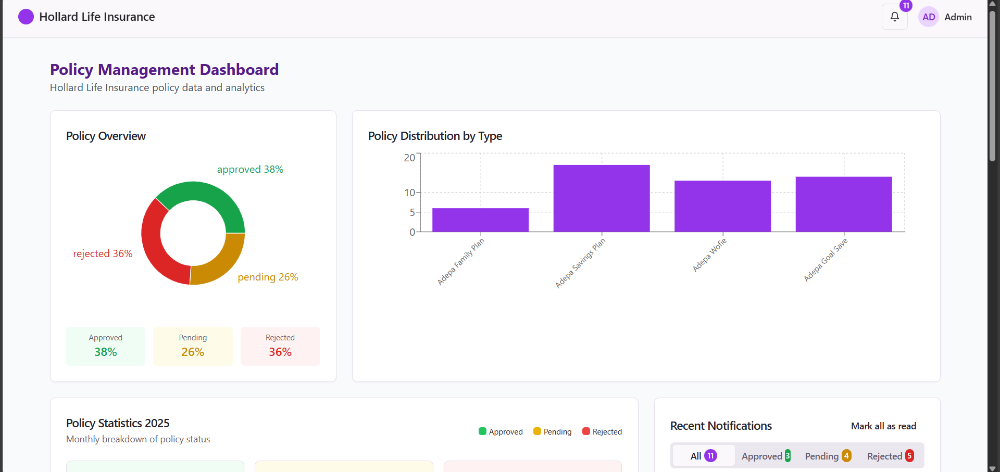

# Policy Data Management System

## Description
The Policy Data Management System is a web-based application designed to automate the tracking of policy approvals, rejections, and pending statuses for underwriting teams at Holland Life Insurance. It features a user-friendly dashboard with data visualization tools, including percentages and charts, to provide real-time insights. The system enables automatic policy status updates to reduce manual verification and reporting errors, improving data management efficiency by minimizing discrepancies and enhancing accuracy. It seamlessly integrates with the current workflow of the underwriting team.

## Features
- **Data Visualization**: Interactive charts and percentages for real-time policy insights.
- **Notification Updates**: Automatic notifications sent when a policy status is updated.
- **Policy Listing**: Displays a list of all policies sold in a production month.
- **Search Functionality**: Search for a specific policy by policy number.

## Screenshot
  

## Installation
Follow these steps to set up the project locally:

1. Clone the repository:
   ```bash
   git clone https://github.com/fkbyjosh/Portfolio-Project-frontend
   ```
2. Install dependencies:
   ```bash
   sudo apt install nodejs
   sudo apt install npm
   ```
3. Navigate to the project directory and start the application:
   ```bash
   cd ~/Portfolio-Project-frontend/prontend
   npm start
   ```

## Usage
1. Access the deployed project at: [https://portfolio-project-frontend-megm.onrender.com](https://portfolio-project-frontend-megm.onrender.com).
2. Log in as an admin to view the dashboard.
3. Use the dashboard to track policy statuses, view visualizations, and search for specific policies by policy number.
4. Receive automatic notifications for policy status updates.

## Technologies
- **Backend**: Django (Python)
- **Frontend**: React (JavaScript), HTML, Tailwind CSS

## Blog Post
Learn more about the development journey of this project in this blog post:  
[Building an Insurance Policy Tracking System: A Journey of Learning and Growth](https://medium.com/@fatow.jay/building-an-insurance-policy-tracking-system-a-journey-of-learning-and-growth-b56923390594)

## Contributing
Contributions are welcome! To contribute:
1. Fork the repository.
2. Create a new branch (`git checkout -b feature/your-feature`).
3. Make your changes and commit them (`git commit -m "Add your feature"`).
4. Push to the branch (`git push origin feature/your-feature`).
5. Open a pull request.

## License
This project is licensed under the MIT License. See the [LICENSE](LICENSE) file for details.

## Contact
For questions or feedback, feel free to reach out:  
- **LinkedIn**: [Joshua Baka](https://www.linkedin.com/in/joshua-baka-001)  
- **GitHub**: [fkbyjosh](https://github.com/fkbyjosh)
```
